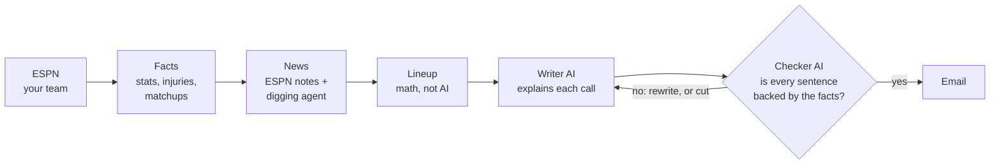

# Fantasy Lineup Assistant

**A weekly start/sit assistant for ESPN fantasy football.** It reads your real team,
gathers the week's stats, injuries, matchups and news, picks the best legal lineup, and
emails you the answer on Sunday morning, with a reason for every call. Every reason is
fact-checked by a second AI before it reaches you.

```
Week 3 (Wed Sep 23): 2 changes to consider

  ▲ Start Parker Washington    ▼ Sit DK Metcalf          +6.5 projected
  ▲ Start Zay Flowers          ▼ Sit Jameson Williams    +7.9 projected

  Zay Flowers — START   [Questionable]
    The coach mentioned he has a good shot to play, though he missed practice
    time mid-week.
    I would monitor his status closely given the hamstring concern reported by ESPN.
    Last games: 26
    vs DAL (away) · favored by 3.5 · total 52.5
    DAL allow the 17th-most points to WRs (30.1 a game)
```

---

## What it does

| | |
|---|---|
| 🏈 **Reads your real team** | Private ESPN leagues. Your league's own lineup slots, your current lineup, kickers and defenses included. |
| 📊 **Gathers the week** | Recent games, injury and practice reports, opponent, betting spread and total, how many points the opponent gives up to that position. |
| 📰 **Reads the news** | ESPN's latest notes for every player. When "will he play?" is still open, an AI agent digs further: team news, practice reports, the depth chart. |
| 🧮 **Picks the lineup** | With math, not AI: the best legal lineup for your league's slots. Players already locked (Thursday games) and players on IR are left alone. |
| ✍️ **Explains every call** | Short notes in plain English, one card per player. |
| ✅ **Fact-checks itself** | A second AI checks every sentence against the data. Anything it can't back up is rewritten or removed. |
| 📬 **Emails you Sunday morning** | A readable email that runs itself on a schedule. No server, no app to open. |

**It tells you when a change isn't worth it.** Swaps worth less than a point are labelled
*toss-up, your call*, and if your lineup is already right it says *nothing I'd change*.

---

## How it works



Two parts of this are genuinely *agentic*, meaning an AI decides the next step in a loop:

- **The news agent** (LangGraph) runs only when a player's status is uncertain. It picks
  from four tools, searches until it can answer *"will he play, and in what role?"*, and
  stops after four tries. It hands back the original news items it found, never its own
  summary, so nothing it writes can be mistaken for evidence.
- **The write → check → rewrite loop** (LangGraph) keeps going until every sentence is
  backed by the facts, or the sentence is cut after two failed rewrites.

Everything else is plain code, on purpose. The same data is needed every week, and the
lineup math is already optimal, so an AI there would only add ways to fail.

---

## Why you can trust what it says

- **The AI never picks your lineup.** It can disagree in a note (and sometimes does), but
  it can't change the answer.
- **Every sentence is checked before it's sent.** In testing, the checker caught **87%** of
  deliberately wrong or made-up sentences, with no false alarms. A sentence that fails and
  can't be fixed is deleted, not sent.
- **Sources are named, not invented.** News comes from ESPN and nflverse only, matched to
  players by ID rather than by name.
- **If the AI is down, you still get your lineup.** Quota used up, servers busy, a garbled
  reply: the email still goes out with the lineup and the figures, and says why the notes
  are missing.

### How much can any start/sit tool help?

Less than most apps suggest, and this one says so. Across 12 past seasons, a simple
rule (recent form, adjusted toward preseason expectations) already set lineups about as
well as anything could. Knowing every player's true ability *and* every matchup would add
only about **3 points a week**. So the value here isn't magic picks. It's the twenty
minutes of tab-switching you skip, and seeing exactly why each call was made. The numbers
are in [docs/FINDINGS.md](docs/FINDINGS.md).

---

## Setup

You'll need Python 3.12+, [uv](https://docs.astral.sh/uv/), and four free accounts.

**1. Install**

```bash
git clone https://github.com/VKKan2002/fantasy-lineup-assistant.git
cd fantasy-lineup-assistant
uv sync
```

**2. Add your keys.** Copy `.env.example` to `.env` and fill it in. `.env` is gitignored.

| Key | Where it comes from |
|---|---|
| `GEMINI_API_KEY` | [Google AI Studio](https://aistudio.google.com/): the writer |
| `GROQ_API_KEY` | [Groq console](https://console.groq.com/): the fact-checker and the news agent |
| `ESPN_S2`, `ESPN_SWID` | Private leagues only. Your browser's cookies on espn.com, while logged in (DevTools → Application → Cookies). A league set to public needs neither, and nothing expires |
| `ESPN_LEAGUE_ID`, `ESPN_TEAM_ID` | Your team page's address: `...?leagueId=…&teamId=…` |
| `RESEND_API_KEY`, `EMAIL_TO` | [Resend](https://resend.com/): sends the email |

**3. Run it**

```bash
uv run python -m ffeval            # print this week's report
uv run python -m ffeval --email    # send it to EMAIL_TO instead
```

A full run takes about three minutes.

**4. Make it weekly (optional).** Add the same keys as repository secrets
(*Settings → Secrets and variables → Actions*). The included workflow runs every Sunday at
9am Eastern and can also be started by hand from the *Actions* tab. It sends the report
without printing it, so your roster never shows up in the logs.

---

## Built with

**Python** · **LangGraph** (both agent loops) · **Groq** `gpt-oss-120b` (fact-checker, news
agent) · **Gemini** `flash-lite` (writer) · **nflverse** (stats, injuries, schedules, depth
charts) · **ESPN** (rosters, news, projections) · **Resend** (email) · **GitHub Actions**
(schedule)

Also included: an [MCP server](mcp_server/) that lets an AI app like Claude Desktop look up
player form directly.

## Good to know

- **ESPN only**, for now. The ESPN cookies last about a year; when they expire, the run
  stops at the ESPN step with a clear error.
- **Email goes to you only** until you verify a domain with Resend. That's Resend's rule
  for free accounts, and a sensible first stage anyway.
- **Early-season projections lean on ESPN's preseason projection**, then shift toward
  what each player has actually done as games pile up.
- **Free AI tiers have limits.** A run uses a handful of requests, well inside them.

## Project layout

```
src/ffeval/
  __main__.py      the weekly command: connects every step, in order
  ingest/          ESPN roster, nflverse facts, news + the digging agent
  graph.py         the write → check → rewrite loop
  writer.py        the writer AI
  audit/           the fact-checker and how it was measured
  report.py        the report text     mail.py   the email
tests/             73 tests, no network needed
docs/              DESIGN.md (every decision and why), FINDINGS.md (the numbers)
```

**Want the reasoning behind a choice?** [docs/DESIGN.md](docs/DESIGN.md) records every
design decision with the real failure that led to it.
