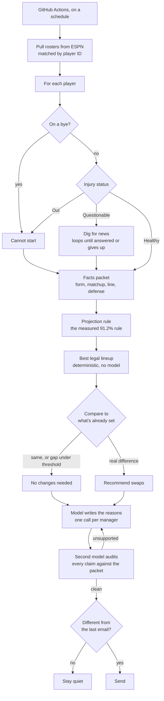
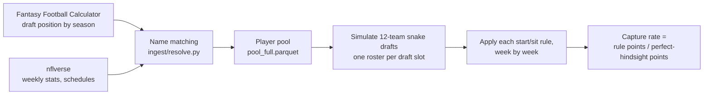

# Design

How this is built and why. The measured numbers live in [FINDINGS.md](FINDINGS.md); the
plain-language overview is in the [README](../README.md).

---

## Architecture



### A workflow, not an agent

The branching is Python. The model does not choose which data to fetch, and it does not set
the lineup.

That's a measured decision rather than a shortcut. A twelve-line rule captures 91.2% of the
available points and an omniscient cheater reaches only 94.0%, so the lineup decision is
nearly saturated — there is nothing for model-driven exploration to discover. Letting a
model pick tools would add failure modes to a problem that doesn't have any left.

One LLM call per manager, not per player. Gemma 4 has a 256K context window, so a full
roster with stats and news fits in one request. Per-player calls would mean roughly 340
requests a week arriving in a burst when cron fires, which is how you trip a per-minute rate
limit for no benefit.

### The two places that genuinely are agentic

**Digging for news.** Open-ended by nature: you search a player, the result points at a
press conference, which points at a depth-chart change. The number of steps depends on what
happened in the world that week, so it can't be written in advance. It loops until it has an
answer or exhausts its budget. Read-only, and it degrades to "nothing found" — high
uncertainty, low blast radius.

**Auditing the explanations.** Runs until every claim is grounded or the budget is spent.
Terminates on a verifiable condition rather than a fixed step count.

Everything else is fixed. The same data gets fetched every week, and `best_lineup()` is
already provably optimal given projections.

### "No changes needed" is a first-class output

Three distinct conditions produce it, and merging them would be a bug:

| Condition | Behaviour |
|---|---|
| Recommendation matches what's already set | "Nothing I'd change" |
| Gap is smaller than the measured noise | "I'd technically swap, but it isn't worth it" |
| Recommendation unchanged since the last email | Send nothing at all |

The threshold for the second case comes from the headroom measurement rather than being
picked by hand — 40% of the weekly decision space is irreducible luck, so a swap worth a
fraction of a point is noise that was quantified, not guessed.

---

## What we claim, and how it gets measured

Two claims are available. Only one is testable, and the difference is worth showing
explicitly because it's the same test that killed four earlier versions of this project.

| | Is the lineup advice good? | Did it make that sentence up? |
|---|---|---|
| Ground truth arrives | after a season | immediately |
| Independent observations | 144 team-seasons in all of history; a live season gives 1 | hundreds of claims per week |
| Baseline bad enough to beat | no — a simple rule captures 91.2% | expected yes, on a 31B model |
| Effect vs. noise | needs ~53 team-seasons | a few hundred labels |

The unit of evaluation changes from team-seasons to claims, and claims are the one thing
this domain has in abundance.

**Method:** hand-label a few hundred generated claims for whether the facts packet supports
them, then compare the unsupported rate with the auditor off and on.

**Scope, stated up front:** this measures faithfulness to the packet, not truth about the
world. It catches "you called this matchup favourable when the number says otherwise." It
cannot catch a wrong number upstream.

**Status: not measured yet.** No number is published until it exists.

---

## Stack

| Piece | Choice | Why |
|---|---|---|
| Data | nflverse via `nflreadpy` 0.1.5 | Already verified; see [FINDINGS.md](FINDINGS.md) |
| Storage | Parquet / DuckDB | Pre-aggregated, no play-by-play needed |
| Rosters | ESPN | Where the league actually lives |
| Orchestration | LangGraph | Real branching on injury status, with failure paths |
| Writer model | `gemini-3.1-flash-lite` | Reliable and fast where Gemma was neither; see below |
| Auditor model | A different hosted model | A writer shouldn't grade itself |
| News | Fetch known sources, search the tail | Documents live five days; nothing to index |
| Email | Resend | Hosts the unsubscribe page, so nothing of ours needs to run |
| Schedule | GitHub Actions cron | No server, no idle cost |

**No vector database.** It was in the original design and got cut. A vector store earns its
place on a corpus you query repeatedly, and fantasy news has a five-day shelf life — nobody
ever asks about last Wednesday's practice report again. Building an ingestion pipeline,
embedding costs and a staleness problem to serve documents nobody re-reads is work for its
own sake.

**No web server.** Cron sends the mail and Resend hosts the preference page, so there is
nothing to keep running and nothing to keep patched. This also means no front end: the email
is the interface.

**MCP is a side door, not a dependency.** [mcp_server/](../mcp_server/) exposes player form
to an AI host directly. Since the pipeline's model never calls tools, MCP has no role in it;
it exists for querying this from something like Claude Desktop.

### Notes on the model choice

Gemma 4 31B is callable through the Gemini API as `gemma-4-31b-it` and is free of charge on
the free tier. There is **no paid tier** for these models, which has a consequence worth
being explicit about: every call is an unpaid-services call, and Google's terms for those
state that content is used to improve their products and that human reviewers may read it.
There is no upgrade path out of that. Hence the rule about personal data below.

**Gemma is unreliable, and the SDK does not retry by default.** Ten identical calls to
`gemma-4-31b-it` failed four times — two 503 "overloaded", two 500 — and took 8 minutes;
the same prompt to `gemini-3.6-flash` succeeded 10 for 10 in 2 minutes. Both error codes are
transient and both are already in the SDK's retry list, but `retry_options=None` means *never
retry*, not *use the defaults*, so every transient failure was killing the run. Passing an empty
`HttpRetryOptions()` turns on 5 attempts with exponential backoff and jitter. A follow-up run
went 3 for 3 before it was stopped to conserve free-tier quota — a small sample, and reported as
one.

**So the writer moved to `gemini-3.1-flash-lite`,** picked on evidence rather than spec sheet.
Given the same packet, `gemini-2.5-flash-lite` wrote "He is expected to practise normally this
week" — the coach's opinion stated as the tool's own fact, which is exactly what Fork 3 of
eval/LABELLING_RULES.md exists to catch — and quoted the 2023 shoulder report the prompt tells it
to ignore. `gemini-3.1-flash-lite` attributed every claim, ignored the stale item, and returned in
2.7s against Gemma's 45.

The cost is stated plainly: writer and auditor are now both Gemini, which is weaker independence
than Gemma's separate lineage gave. Accepted because numbers are templated — the writer no longer
produces facts for an auditor to be fooled by, only commentary. It is also decidable rather than
arguable: run both pairings against the labelled set and compare what the auditor catches. If the
Gemini pairing catches less, the blind spot is real and shows up as a number.

This is a scheduling risk, not just an annoyance: the pipeline runs from a weekly cron, so a
transient failure that is not retried means no email goes out and nobody finds out. Retrying was
preferred over switching the writer to Flash, because Flash is the auditor and a writer must not
grade itself.

Worth knowing: 429 is on that same retry list. Exhausting the *daily* free-tier quota will
therefore burn ~30s of pointless backoff before failing. Harmless, and not worth special-casing
until it happens.

Two things still to verify empirically rather than trust from docs:

- Whether Google Search grounding works with Gemma. Google's own pages disagree — the
  Gemma-on-Gemini-API page lists it as supported, while the pricing page marks it
  unavailable in both tiers and the grounding doc's model table omits Gemma entirely. Build
  the search tool assuming it doesn't.
- Whether the free tier includes Resend contacts and topics, and whether the hosted
  unsubscribe page is available on regular sends or only on Broadcasts.

---

## Design rules that earned their place

None of these are style preferences. Each exists because its absence produced a specific
wrong answer, or because a measurement ruled the alternative out.

### From the data work

**Lookup failure and real absence are counted separately.** If a draft-list name doesn't
resolve to a player ID, that's a bug — we lost a real player. If it resolves but the player
recorded no games, that's usually the truth: Le'Veon Bell held out all of 2018, Ray Rice and
Josh Gordon were suspended, others got hurt in preseason. The first version of the gate
treated both as failures, which made it impossible to pass. Now the join rate carries the
hard threshold and the play rate is reported for information.

**Never add a name alias from memory.** A wrong alias credits one player's season to
another, which is worse than leaving the row unmatched. Every entry in the alias table was
proposed by [checks/g2_verify_aliases.py](../checks/g2_verify_aliases.py), which asks a much
stronger question than "which name looks similar?" — *who actually played that position, for
that team, in that season, and isn't already claimed by another draft row?* That's how
"Hollywood Brown" was confirmed as Marquise Brown: four seasons of support averaging 175.5
points against a next-best two at 89.8, and a team path of BAL→BAL→ARI→ARI→KC that traces
his real career. No string-similarity check will ever find that one.

**Name collisions are broken by production.** Suffix stripping maps "Frank Gore Jr." and
"Frank Gore" to the same key. The first version silently kept whichever row came first,
crediting a Hall-of-Fame back's season to his son — 81 times across different players. Ties
are now broken on who actually recorded snaps in the target season.

**Position is deliberately not part of the join key.** Sources disagree — Cordarrelle
Patterson is a receiver to one and a running back to the other in some years — and a
position mismatch would silently drop a real player.

### From the modelling work

**Both lineup rules are always computed.** Scoring a roster with perfect weekly hindsight
inflates the result, and the inflation grows with how volatile the players are. Two coin-flip
players scoring 5 or 25: committing in advance averages 15, always starting the one who
boomed averages 20. On a real 2019 roster the gap was 1,422 versus 1,644 — a **15.6% premium
no real manager can earn.** Since volatility is exactly what strategies differ on, reporting
only the hindsight number would bias every comparison.

**The expected-points curve is fit leave-one-season-out.** Mapping draft position to points
is a fitted model, not a lookup table. Including the target season would leak that season's
outcome into its own projection.

**That curve is forced to never rise with a later pick.** Single draft ranks are noisy across
~11 seasons, so the curve gets a rolling mean over neighbouring ranks and then a running
minimum. Monotonicity is the one thing we know a priori must hold.

**No arbitrary cap on pool size.** An early version cut each season's pool at the top 150
players — our choice, not the data's. Start/sit needs bench depth, or every rule gets forced
into identical lineups and the comparison measures nothing. Real pool depth runs from 146
players (2022) to 206 (2025).

**Draft-time and game-time information are not interchangeable.** Betting lines are set right
before kickoff: using them in a preseason draft model is cheating, while using them for a
Sunday-morning lineup call is completely fine. The 2009 draft data on this API was actually
collected in **June 2010**, ten months after that season ended. Every season's draft window
is now verified to close before Week 1 kickoff. All 12 pass, but 2015 clears by a single day,
which is why it's checked rather than assumed.

**Correlation cannot evaluate a draft strategy.** Ranking players by last season's points
appears to beat real draft-market consensus — 0.528 against 0.375 — when positions are
pooled. That's Simpson's paradox: quarterbacks average 252 points against tight ends at 147,
so ranking by raw points inherits the position ordering for free, while the market
deliberately deviates from raw points to price scarcity. Within position, consensus wins
0.634 to 0.528 and takes all 12 seasons. And the "winning" baseline would have drafted nine
quarterbacks in the first fifteen picks of 2022. Correlation is blind to roster constraints.

### From the assistant design

**The model never sets the lineup.** [best_lineup()](../src/ffeval/scoring/lineup.py) is
provably optimal given projections and already measured. The model writes prose. If it
disagrees it can say so in a sentence; it cannot change the answer. That keeps the
recommendation auditable and caps what a hallucination can cost.

**Free text annotates; structured data decides.** News fetched from the open web is untrusted
input that ends up in mail sent to other people. A projection may only move on a structured
field — nflverse ruling a starter out — never on an article's prose. A page crafted to
manipulate the model can add a misleading sentence, which is visible and fixable. It cannot
produce a wrong lineup.

**One question per checker: the auditor judges evidence, code enforces policy.** A synthetic
example makes the fork concrete. A news snippet states a pressure rate of 34%; that figure
appears nowhere in the structured facts. If the writer repeats it, is the sentence faithful?

Two jobs are being conflated. "Is this sentence supported by the packet?" is a judgment call
that needs a model — and the answer is yes, the number is right there in the evidence,
*provided the sentence attributes it* ("a beat writer noted..."). Stated bare, as the tool's own
figure, it fails a separate attribution rule; see eval/LABELLING_RULES.md fork 3. "May a
number rest on prose?" is a policy question with a fixed answer, and it needs no model at all:
extract the numbers from the sentence, look them up in `packet.numbers()`, drop the sentence
if they are absent. Ten lines, perfectly reliable.

So the auditor rules SUPPORTED and a separate deterministic gate drops the sentence anyway.
Same outcome, and the reason is recoverable. Fold the policy into the auditor's prompt instead
and a bad score cannot tell you which of the two judgments failed, so there is nothing to tune
against.

The cost, stated plainly: SUPPORTED no longer means publishable. Shipping a sentence requires
passing both layers, and that is a property of the pipeline rather than of any single verdict.

**The two layers share how a number is read and not which numbers count.** They run through one
matching helper, so they can never disagree about whether "25" matches 25.29. They consult
different lists on purpose, and one flipped test is why. The packet's week is 3. The moment the
baseline checker could see it, "Buffalo is a 3-point underdog" — false, the spread is +12.5 —
found a 3 to match and passed, dropping the measured recall from 5 of 15 to 4. That checker never
understood spreads; it caught the sentence because no fact happened to carry a 3, and adding a
small integer to its vocabulary removed the luck. So `numbers()` is fact values only and answers
"does the packet confirm this?", while `sourced_numbers()` answers "where did this digit come
from?" and adds two things we wrote ourselves: the header's season and week, and the numbers
inside fact labels. The labels are not decoration — without them the gate refused "Allen scored
38.76 points in week 1" over the 1, which is a true sentence and a supported one.

The alternative was to let the floor drop to 27% and note it. Rejected: the baseline is what the
LLM auditor is measured against, and lowering it for a reason unrelated to either auditor's
ability makes the model look better for nothing. A comparison that moves because the comparison
point got worse is the first thing a reader should distrust.

**The gate does not catch lies, and must not be asked to.** It passes "Buffalo is a 3-point
underdog" — the 3 really did come from the packet header. Whether the sentence is *true* is the
auditor's question, answered against a different list. Two layers, two questions, and neither one
covering for the other is what keeps a bad score attributable.

**The model never types a number.** Every figure in the output is rendered from a fact by
`writer._line()`; the model receives the same facts and is asked for judgement and news only.
Any sentence it returns carrying a digit is dropped, not trusted. A figure that cannot be typed
cannot be mistyped, which retires most of what the auditor exists to catch and leaves the auditor
as a backstop rather than the only defence. The rule holds in practice — asked for notes on a
packet, the model wrote "a high volume of points" and "a high pressure rate" rather than 27.89
and 34%.

**Templated lines and model sentences never merge.** [writer.py](../src/ffeval/writer.py) returns
them in separate fields all the way out. Auditing our own templated lines against our own facts
proves nothing and would flatter every score; the number worth measuring is how often the *model*
invents something, and that needs its sentences alone. Refused sentences are kept in a third
field rather than discarded, so a prompt that has started emitting digits shows up as visible
output instead of quietly shrinking.

**Only rejected sentences go back, and the budget is per roster.** Rewriting a whole
player's notes would let a sentence that already passed come back worse, and no score could
then say whether the loop helped — the same isolation argument as the two number lists. The
budget is two rounds for the entire roster rather than two per sentence, because
one-call-per-manager exists to keep a burst off a per-minute rate limit and per-sentence
retries would quietly reintroduce it.

**The writer is told why it failed, and that is a cost, not a free win.** Passing the
auditor's reason back is what makes a retry better than a re-roll. It also teaches the
writer to satisfy the auditor rather than the packet — studying for the test — and that
matters more now that both are Gemini. Accepted deliberately, recorded here so a future
score that looks too good has a suspect.

**"Nothing supportable to say" is an available answer, and it gets used.** The rewrite
prompt lets the model return an empty string instead of a replacement. On the first live
run that is exactly what happened: told the packet did not support "a focal point of the
offense and a high floor", the writer offered nothing rather than a softer version of the
same claim, and the sentence was cut. A loop that can only ever produce replacements would
have invented one.

**Nothing personal goes into a prompt.** The free tier trains on submitted content and has no
paid tier to upgrade into, so names and email addresses never enter a prompt. The model sees
an anonymous roster; the email is assembled in our own code.

**A different model does the auditing.** A model grading its own output is soft on itself.
Writer and auditor are deliberately different models, which costs nothing on a free tier and
removes a shared blind spot.

**A packet reads from an allowlist of columns, never a blocklist.** `load_schedules()`
carries `result`, `home_score` and `away_score` in the same row as `spread_line` and
`total_line`. A blocklist admits whatever nflverse adds next, which is how the outcome of a
game ends up in the evidence used to predict it. The allowlist in
[ingest/packets.py](../src/ffeval/ingest/packets.py) fails closed instead. Betting lines
themselves are fair game here — they are set before kickoff, unlike in a preseason draft
model, where the same column would be cheating.

**Search results carry their date, visibly.** A query for a player's injury returns articles
from three seasons ago. Dates are filtered on and displayed, so a stale citation is obvious
rather than quietly authoritative.

**"I couldn't find anything" is a valid, visible answer,** and there is always a plain
statistical fallback, so the tool still works when the clever parts are down.

**Record and replay external calls.** Search results change daily, so there is no stable
input to test against. Real responses get saved to fixtures and replayed. Without this the
news loop is undebuggable.

---

## How the measurement pipeline works



The key measure is **capture rate**: what a rule scored, divided by what a perfect hindsight
lineup would have scored from the same roster. It's bounded and readable — 100% means you
started exactly the right players every week, and random filling is the floor.

Everything is 12-team PPR (one point per catch), 12 rounds, positions QB/RB/WR/TE, with 7
starters a week (1 QB, 2 RB, 2 WR, 1 TE, 1 FLEX). Kickers and team defenses are left out:
they're drafted last, close to random, and a team defense joins to the data differently.

---

## Repo map

```
src/ffeval/              The library
  ingest/ids.py          Name normalization, the alias table, team abbreviation fixes
  ingest/resolve.py      Draft names -> real player IDs, in two stages
  ingest/packets.py      nflverse -> facts packets. Column allowlist and a strict
                         week cutoff keep the outcome out of the evidence
  scoring/league.py      League settings, snake draft pick order
  scoring/lineup.py      Weekly lineup building and season scoring
  models/expected.py     Draft position -> expected points, fit leave-one-season-out
  audit/verdicts.py      The four verdicts, and which of them count as unfaithful
  audit/packet.py        The evidence a claim may rest on; reads JSON, no network
  audit/auditor.py       Sentence splitter, the baseline checker, the LLM auditor,
                         and unsourced_numbers() - layer 2's numeric-source gate
  audit/evaluate.py      Scores an auditor against the labelled claims
  writer.py              Facts packet -> the prose a manager reads. Numbers are
                         templated here; the model only writes the words around them
  pipeline.py            Write, audit, rewrite what failed, cut what never came
                         clean. The only code that owns both sides

checks/                  Runnable experiments and data gates
  out/                   Generated results — not committed, always rebuildable

eval/                    The auditor's evaluation set
  LABELLING_RULES.md     The four forks, settled, and the labelling procedure
  packets/               Hand-built facts packets: real facts, synthetic news
  cases/                 Labelled claims, one file per packet
  reference_labels/      An independent Claude pass, kept for agreement checks
  label.py               Interactive labeller — one keystroke per claim
  out/                   Results — not committed

mcp_server/              MCP server and a client that prints the wire traffic

docs/DESIGN.md              This file
docs/FINDINGS.md            Every measured number, with the script that produced it
docs/BACKTEST_EXPLAINED.md  How the headroom measurement works, in plain language
docs/step1_headroom.png     The headroom chart (tracked, because it backs a claim)

plan.md                  STALE — predates the current design, see Known issues
later.md                 Parked ideas and docs owed, with the reason each is parked
archive/                 Four earlier project directions and why each was dropped
tools/                   Mermaid diagram validator
```

---

## Running it

Python 3.12+ and [uv](https://docs.astral.sh/uv/), plus internet access. Data is fetched live
from nflverse and the Fantasy Football Calculator API; nothing is vendored.

```bash
uv sync
```

### Reproducing the numbers

In order — the first builds the player pool everything else reads. `checks/out/` is
deliberately not committed, so a fresh clone rebuilds it.

```bash
# 1. Build the player pool: 12 seasons of draft data matched to real player IDs
uv run python checks/step1_build_pool.py

# 2. How good are simple start/sit rules?
uv run python checks/step1_baseline.py

# 3. How much of the remaining gap is forecastable rather than luck?
uv run python checks/step1b_ceiling.py

# 4. Is week-specific information (matchups) worth anything?
uv run python checks/step1c_matchup.py

# 5. Redraw the chart
uv run python checks/plot_step1.py
```

Each prints to the terminal and writes a `.parquet` into `checks/out/`. The steps that fetch
draft data pause between seasons so the free API isn't hammered — expect a minute or two.

### The data gates

These check the data rather than producing findings.

```bash
# Does every draft-list name resolve to a real player ID?
# Hard gate at 99% — exits non-zero below that, so it works in CI.
uv run python checks/g2_id_resolution.py
uv run python checks/g2_id_resolution.py --suggest   # also propose new name aliases

# Propose aliases from roster evidence instead of string similarity
uv run python checks/g2_verify_aliases.py
```

The first reports two separate numbers, because only one of them is a bug.

### The claim auditor

```bash
# Score the deterministic checker against the labelled claims.
# No model, no API key, no network.
uv run python -m ffeval.audit.evaluate --baseline

# Label claims interactively: one keystroke per claim, saves after each.
uv run python eval/label.py
uv run python eval/label.py --list     # progress only, changes nothing
```

The first prints a confusion matrix, the always-supported floor beside every score, and a list
of every bad claim it missed. It exits non-zero if it fails to beat the floor, so it works in
CI. Numbers and interpretation are in [FINDINGS.md](FINDINGS.md) section 8.

### The MCP server

```bash
uv run python mcp_server/demo_client.py
```

Launches the server as a child process and walks through tool discovery, a real call, a
missing player, an ambiguous name, and an optional argument — printing the JSON at each step.
No AI involved; it's one program exchanging JSON with another, which is all MCP ever is.

### Validating diagrams

```bash
mkdir -p ~/.mmv && cd ~/.mmv && npm install mermaid jsdom
cp tools/validate_mermaid.mjs ~/.mmv/ && node ~/.mmv/validate_mermaid.mjs <file>.md
```

The script must live beside `node_modules` — see Known issues.

---

## Data sources

**nflverse**, via `nflreadpy` 0.1.5 — weekly player stats, injuries with practice
participation, schedules, betting lines, stadium conditions and coaches. All 12 seasons of
weekly stats is 217,490 rows and 155 MB, loading in about 1.6 seconds at 223 MB peak memory.
Pre-aggregated, so play-by-play is never needed, which removes all memory pressure on a small
machine.

One subtlety that carries real signal: **a row exists only if the player was active.** No row
means a bye or inactive; a row scoring 0.0 means he played and did nothing.

**Fantasy Football Calculator** — free draft-position data, no API key. Returns average draft
position, its spread, high and low picks, times drafted, plus a metadata block giving the
draft window, which is what makes the timing check possible.

**ESPN** — league rosters, for the live tool. Joined by ESPN player ID rather than by name:
every active skill player carries one, so the name-matching machinery above isn't needed
here. One league member's credentials read every team in that league, which is why nobody is
ever asked to hand over their own. Credentials live in a gitignored `.env` and in GitHub
Actions secrets, never in the repo.

---

## Build status

| | State |
|---|---|
| Ceiling measurement | done |
| Data pipeline, ID resolution, gates | done |
| Projection rule, lineup builder | done |
| MCP server (side door) | done, minimal |
| Facts packet ([packet.py](../src/ffeval/audit/packet.py)) | **done** |
| Verdict types ([verdicts.py](../src/ffeval/audit/verdicts.py)) | **done** |
| Claim splitter + deterministic baseline checker ([auditor.py](../src/ffeval/audit/auditor.py)) | **done** |
| Evaluation harness ([evaluate.py](../src/ffeval/audit/evaluate.py)) | **done — 33% recall measured** |
| Packet builder ([ingest/packets.py](../src/ffeval/ingest/packets.py)) | **done — rebuilds the hand-typed packet fact for fact** |
| Labelled eval set (1 packet, 30 claims) | done — labels are AI-written, see below |
| LLM auditor (prompt, model call, parsing) | **done — 93% recall vs 33% baseline** |
| Test suite | **38 tests** — deterministic layer, the gate, prompt/parse plumbing, the writer ([tests/](../tests/)) |
| Numeric-source gate (layer 2) | **done — refuses 4 of 30 eval claims, no false refusals** |
| Templated numeric prose | **done — see writer.py** |
| Writer ([writer.py](../src/ffeval/writer.py)) | **done — templated numbers, model prose, 5 tests** |
| Rewrite loop ([pipeline.py](../src/ffeval/pipeline.py)) | **done — 1 of 6 sentences was unfaithful; the loop cut it** |
| News search and the digging loop | not started |
| ESPN roster fetch | not started |
| Email, change-gating, cron | not started |

### What the deterministic baseline measured

`uv run python -m ffeval.audit.evaluate --baseline` — see
[FINDINGS.md](FINDINGS.md) section 8 for the numbers and what they mean.

The headline: a regex that only reads numbers catches **33% of unfaithful claims**, and every
one of its ten misses is an *abstention* rather than a wrong answer. Its weakness is coverage,
not accuracy — it declines to rule on 19 of 30 sentences because they contain no digits. And
8 of the 10 misses need the verdict `not_in_packet`, which the baseline structurally cannot
produce.

That gave the LLM auditor a floor to beat and a named job: **rule on sentences with no
numbers, and be able to say "absent" rather than "wrong."**

### What the LLM auditor measured

Gemini 3.6 Flash, temperature 0, one call per packet: **93% recall on unfaithful claims against
the baseline's 33%**, zero false alarms, and `not_in_packet` produced correctly 7 times out of
the 8 that needed it. Full numbers, the reasoning it gave, and the caveats are in
[FINDINGS.md](FINDINGS.md) section 9.

The result worth keeping is not the 93%. It is that the first run cited two evidence ids that
did not exist, because `render()` showed facts with ids and news without — a bug in the harness,
found by the measurement rather than by review. `evaluate.py` now reports fabricated citations
every run.

### Honest limit on the current eval set

The 30 labels were written by Claude, not by a human. So a score for the *LLM* auditor against
them would be partly circular — one model checked against another model's reading of the same
packet. The baseline number above is unaffected, because a regex is not a model.

Recovery is cheap and recorded in the case file's `_provenance` block: clear a claim's `source`
and rerun [eval/label.py](../eval/label.py). Any human-labelled subset immediately yields a
real agreement rate against the preserved Claude pass in `eval/reference_labels/`.

### Rough effort for the rest

The LLM auditor is 1–2 days, mostly prompt iteration rather than code, now that the harness
and the floor exist. The news loop is 4–6 days and is the one most likely to overrun, because
every external source is its own failure mode. ESPN roster fetch is the biggest unknown —
somewhere between a day and three, depending on how private-league auth behaves.

Tests come before the prompt work, and not for tidiness: prompt output is stochastic, so the
deterministic half has to be pinned first. Otherwise a recall number that moves from 33% to 41%
to 36% has two possible causes and no way to separate them.

**Standing risk:** scope creep back toward proving it out-picks a simple rule. It doesn't.
That's settled, it's at the top of the README, and it isn't worth re-litigating with more
compute.

---

## Known issues

**[plan.md](../plan.md) is stale.** It predates these decisions and still describes a vector
store, a web server, and a model that picks its own tools. Read this file instead until it's
rewritten.

**The instructions in [tools/README.md](../tools/README.md) don't work.** They say to install
`mermaid` and `jsdom` anywhere and run the validator from that directory. Node resolves ESM
imports from the *script's* location, walking up from `tools/`, so it never finds
`~/.mmv/node_modules`. Copy the script next to `node_modules` and run it there, or vendor a
`package.json`.

**`render()` shows the header without ids.** `sourced_numbers()` can now cite `header.week`,
but the packet text the model reads prints "Week: 3" with no id beside it, so the LLM auditor
cannot cite what the deterministic layers can. Harmless today — the gate emits no evidence ids
and the baseline cites fact ids only — but it is the same asymmetry that produced fabricated
citations in section 9. Fix it at the next `PROMPT_VERSION` bump, not before: changing `render()`
changes the prompt, and the published 93% was measured under version 1.
